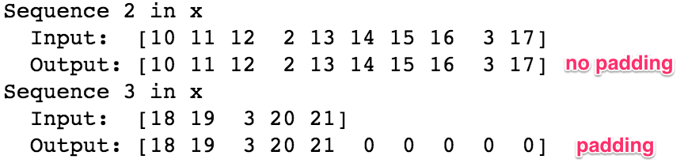
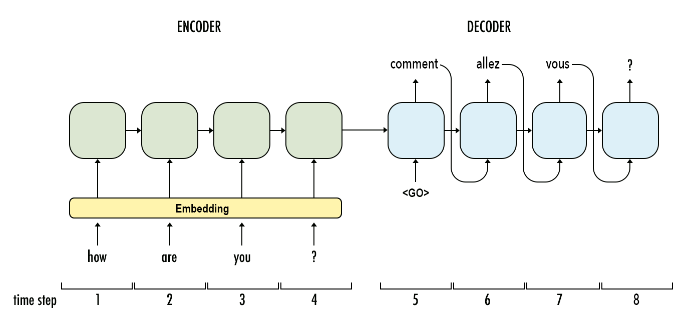

# Handwritten Text Recognition with TensorFlow 


Handwritten Text Recognition (HTR) system implemented with TensorFlow (TF) and trained on the IAM off-line HTR dataset.
This Neural Network (NN) model recognizes the text contained in the images of segmented words as shown in the illustration below.
3/4 of the words from the validation-set are correctly recognized, and the character error rate is around 10%.


## Run demo
[Download the model](https://www.dropbox.com/s/g26azicgcyfjv3d/model.zip?dl=1) trained on the IAM dataset. Put the contents of the downloaded file model.zip into the model directory of the repository. Afterwards, go to the `src` directory and run `python main.py`.
The input image and the expected output is shown below.


```
> python main.py
Init with stored values from ../model/snapshot-39
Recognized: "Hello"
Probability: 0.42098286747932434
```


## Command line arguments
* `--train`: train the NN on 95% of the dataset samples and validate on the remaining 5%
* `--validate`: validate the trained NN
* `--decoder`: select from CTC decoders "bestpath", "beamsearch". Defaults to "bestpath".
* `--batch_size`: batch size
* `--data_dir`: directory containing IAM dataset (with subdirectories `img` and `gt`)
* `--dump`: dumps the output of the NN to CSV file(s) saved in the `dump` folder. Can be used as input for the CTCDecoder.

If neither `--train` nor `--validate` is specified, the NN infers the text from the test image (`data/test.png`).


## Train model with IAM dataset

Follow these instructions to get the IAM dataset:

* Register for free at this [website](http://www.fki.inf.unibe.ch/databases/iam-handwriting-database)
 **OR** you can download it from : [Download the words.tgz](https://www.dropbox.com/s/71kfxwv40iaweos/words.tgz?dl=1)
* Download `words/words.tgz`
* Create a directory for the dataset on your disk, named: `img` 
* Put the content (directories `a01`, `a02`, ...) of `words.tgz` into the `img` directory

### Start the training

* Delete files from `model` directory if you want to train from scratch
* Go to the `src` directory and execute `python main.py --train --data_dir path/to/IAM`
* Training stops after a fixed number of epochs without improvement

## Information about model

The model is a stripped-down version of the HTR system consists of 5 CNN layers, 2 RNN (LSTM) layers and the CTC loss and decoding layer.
The illustration below gives an overview of the NN (green: operations, pink: data flowing through NN) and here follows a short description:

* The input image is a gray-value image and has a size of 128x32
* 5 CNN layers map the input image to a feature sequence of size 32x256
* 2 LSTM layers with 256 units propagate information through the sequence and map the sequence to a matrix of size 32x80. Each matrix-element represents a score for one of the 80 characters at one of the 32 time-steps
* The CTC layer either calculates the loss value given the matrix and the ground-truth text (when training), or it decodes the matrix to the final text with best path decoding or beam search decoding (when inferring)


### -----------------------------------------------------------------------------------------------------
# Machine Translation with RNNs

##### &nbsp;


*Image credit: [xiandong79.github.io](https://xiandong79.github.io/seq2seq-%E5%9F%BA%E7%A1%80%E7%9F%A5%E8%AF%86)*

##### &nbsp;

## Goal
In this part, we build a deep neural network that functions as part of a machine translation pipeline. The pipeline accepts English text as input and returns the French translation. The goal is to achieve the highest translation accuracy possible.

## Background
The ability to communicate with one another is a fundamental part of being human. There are nearly 7,000 different languages worldwide. As our world becomes increasingly connected, language translation provides a critical cultural and economic bridge between people from different countries and ethnic groups. Some of the more obvious use-cases include:
- **business**: international trade, investment, contracts, finance
- **commerce**: travel, purchase of foreign goods and services, customer support
- **media**: accessing information via search, sharing information via social networks, localization of content and advertising
- **education**: sharing of ideas, collaboration, translation of research papers
- **government**: foreign relations, negotiation  


To meet this need, technology companies are investing heavily in machine translation. This investment paired with recent advancements in deep learning have yielded major improvements in translation quality. According to Google, [switching to deep learning produced a 60% increase in translation accuracy](https://www.washingtonpost.com/news/innovations/wp/2016/10/03/google-translate-is-getting-really-really-accurate) compared to the phrase-based approach used previously. Today, translation applications from Google and Microsoft can translate over 100 different languages and are approaching human-level accuracy for many of them.

However, while machine translation has made lots of progress, it's still not perfect. :grimacing:


_Bad translation or extreme carnivorism?_


##### &nbsp;

## Approach
To translate a corpus of English text to French, we need to build a recurrent neural network (RNN). Before diving into the implementation, let's first build some intuition of RNNs and why they're useful for NLP tasks.

### Building the Pipeline
Below is a summary of the various preprocessing and modeling steps. The high-level steps include:

1. **Preprocessing**: load and examine data, cleaning, tokenization, padding
1. **Modeling**: build, train, and test the model
1. **Prediction**: generate specific translations of English to French, and compare the output translations to the ground truth translations
1. **Iteration**: iterate on the model, experimenting with different architectures

### Toolset
We use Keras for the frontend and TensorFlow for the backend in this part. I prefer using Keras on top of TensorFlow because the syntax is simpler, which makes building the model layers more intuitive. However, there is a trade-off with Keras as you lose the ability to do fine-grained customizations. But this won't affect the models we're building in this part.  

##### &nbsp;

## Preprocessing

### Load & Examine Data
Here is a sample of the data. The inputs are sentences in English; the outputs are the corresponding translations in French.

> 

##### &nbsp;

When we run a word count, we can see that the vocabulary for the dataset is quite small. This was by design for this part. This allows us to train the models in a reasonable time.

> 

### Cleaning
No additional cleaning needs to be done at this point. The data has already been converted to lowercase and split so that there are spaces between all words and punctuation.

_Note:_ For other NLP projects you may need to perform additional steps such as: remove HTML tags, remove stop words, remove punctuation or convert to tag representations, label the parts of speech, or perform entity extraction.  

### Tokenization
Next we need to tokenize the data&mdash;i.e., convert the text to numerical values. This allows the neural network to perform operations on the input data. For this part, each word and punctuation mark will be given a unique ID. (For other NLP projects, it might make sense to assign each character a unique ID.)

When we run the tokenizer, it creates a word index, which is then used to convert each sentence to a vector.

> 

### Padding
When we feed our sequences of word IDs into the model, each sequence needs to be the same length. To achieve this, padding is added to any sequence that is shorter than the max length (i.e. shorter than the longest sentence).

> 

##### &nbsp;

## Modeling
First, let's breakdown the architecture of a RNN at a high level. Referring to the diagram above, there are a few parts of the model we to be aware of:

1. **Inputs** &mdash; Input sequences are fed into the model with one word for every time step. Each word is encoded as a unique integer or one-hot encoded vector that maps to the English dataset vocabulary.
1. **Embedding Layers** &mdash; Embeddings are used to convert each word to a vector. The size of the vector depends on the complexity of the vocabulary.
1. **Recurrent Layers (Encoder)** &mdash; This is where the context from word vectors in previous time steps is applied to the current word vector.
1. **Dense Layers (Decoder)** &mdash; These are typical fully connected layers used to decode the encoded input into the correct translation sequence.
1. **Outputs** &mdash; The outputs are returned as a sequence of integers or one-hot encoded vectors which can then be mapped to the French dataset vocabulary.

##### &nbsp;

### Embeddings
Embeddings allow us to capture more precise syntactic and semantic word relationships. This is achieved by projecting each word into n-dimensional space. Words with similar meanings occupy similar regions of this space; the closer two words are, the more similar they are. And often the vectors between words represent useful relationships, such as gender, verb tense, or even geopolitical relationships.


Training embeddings on a large dataset from scratch requires a huge amount of data and computation. So, instead of doing it ourselves, we'd normally use a pre-trained embeddings package such as [GloVe](https://nlp.stanford.edu/projects/glove/) or [word2vec](https://mubaris.com/2017/12/14/word2vec/). When used this way, embeddings are a form of transfer learning. However, since our dataset for this project has a small vocabulary and little syntactic variation, we'll use Keras to train the embeddings ourselves.

##### &nbsp;

### Encoder & Decoder
Our sequence-to-sequence model links two recurrent networks: an encoder and decoder. The encoder summarizes the input into a context variable, also called the state. This context is then decoded and the output sequence is generated.
Since both the encoder and decoder are recurrent, they have loops which process each part of the sequence at different time steps. To picture this, it's best to unroll the network so we can see what's happening at each time step.

In the example below, it takes four time steps to encode the entire input sequence. At each time step, the encoder "reads" the input word and performs a transformation on its hidden state. Then it passes that hidden state to the next time step. Keep in mind that the hidden state represents the relevant context flowing through the network. The bigger the hidden state, the greater the learning capacity of the model, but also the greater the computation requirements. We'll talk more about the transformations within the hidden state when we cover gated recurrent units (GRU).



For now, notice that for each time step after the first word in the sequence there are two inputs: the hidden state and a word from the sequence. For the encoder, it's the _next_ word in the input sequence. For the decoder, it's the _previous_ word from the output sequence.
Also, remember that when we refer to a "word," we really mean the _vector representation_ of the word which comes from the embedding layer.

##### &nbsp;

### Final Model
Now that we've discussed the various parts of our model, let's take a look at the code.

```python

def  model_final (input_shape, output_sequence_length, english_vocab_size, french_vocab_size):
    """
    Build and train a model that incorporates embedding, encoder-decoder, and bidirectional RNN
    :param input_shape: Tuple of input shape
    :param output_sequence_length: Length of output sequence
    :param english_vocab_size: Number of unique English words in the dataset
    :param french_vocab_size: Number of unique French words in the dataset
    :return: Keras model built, but not trained
    """
    # Hyperparameters
    learning_rate = 0.003

    # Build the layers    
    model = Sequential()
    # Embedding
    model.add(Embedding(english_vocab_size, 128, input_length=input_shape[1],
                         input_shape=input_shape[1:]))
    # Encoder
    model.add(Bidirectional(GRU(128)))
    model.add(RepeatVector(output_sequence_length))
    # Decoder
    model.add(Bidirectional(GRU(128, return_sequences=True)))
    model.add(TimeDistributed(Dense(512, activation='relu')))
    model.add(Dropout(0.5))
    model.add(TimeDistributed(Dense(french_vocab_size, activation='softmax')))
    model.compile(loss='sparse_categorical_crossentropy',
                  optimizer=Adam(learning_rate),
                  metrics=['accuracy'])
    return model
```
##### &nbsp;
##### &nbsp;


